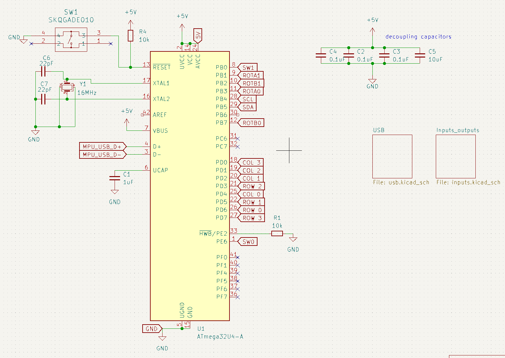
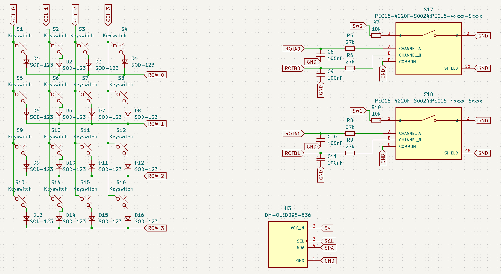
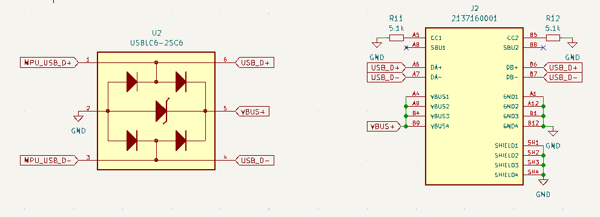
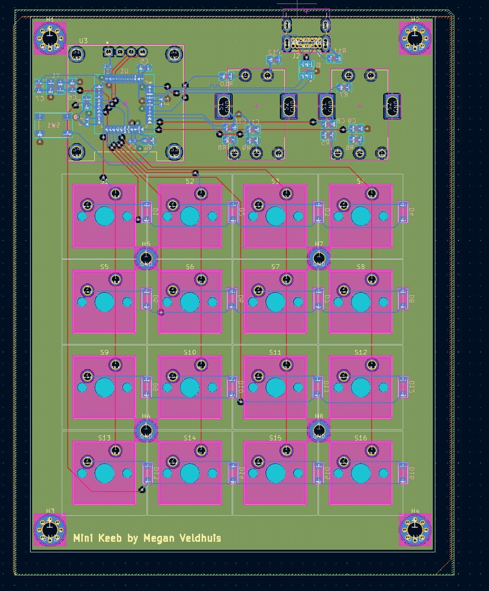
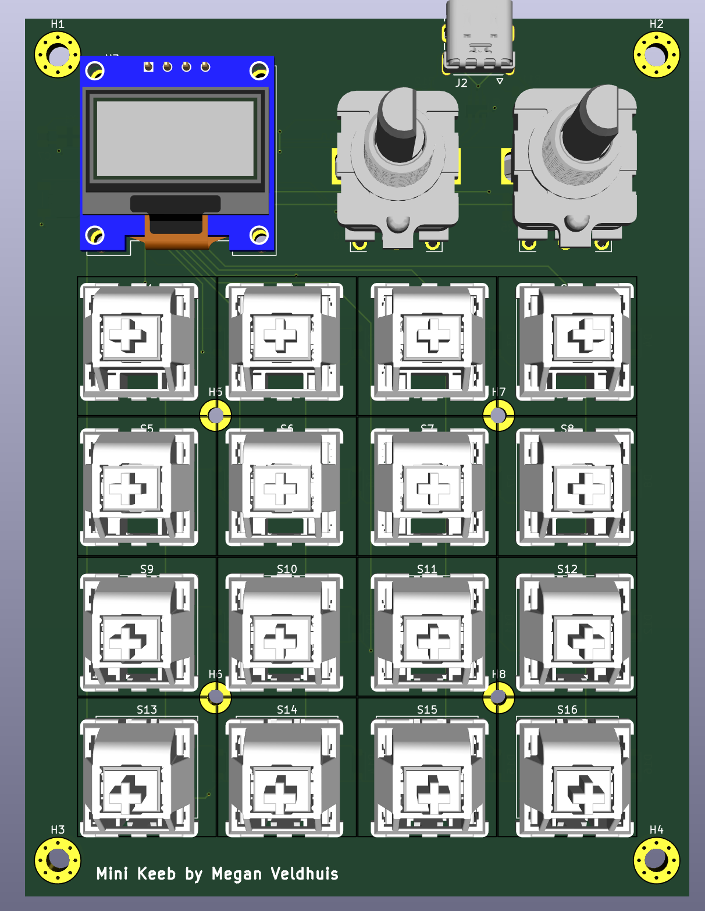
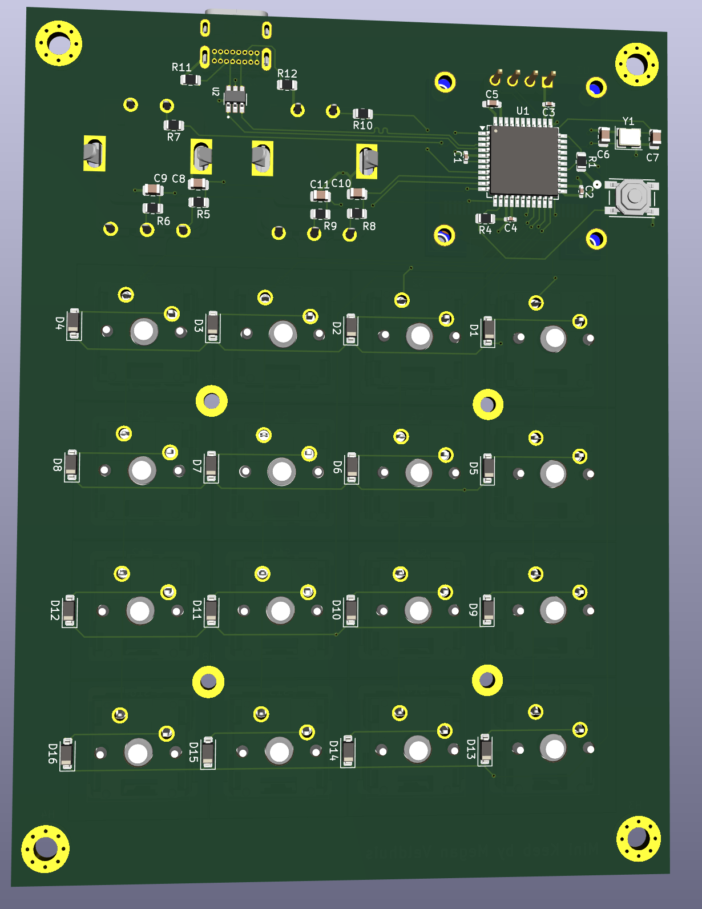

# Mini Keeb

## Hardware

### Components

- 16 Cherry MX Switches
- 2 rotary encoders
- 1 128x64 OLED (0.96")

### Schematic

### PCB

( slightly outdated screenshots )

## Software

coming soon
